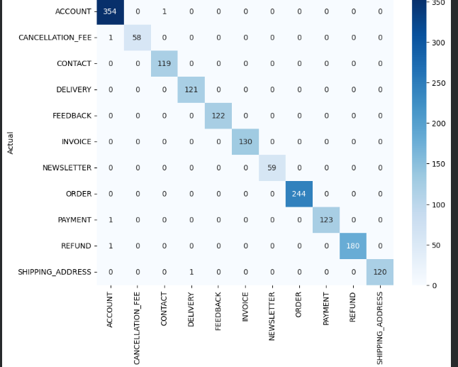
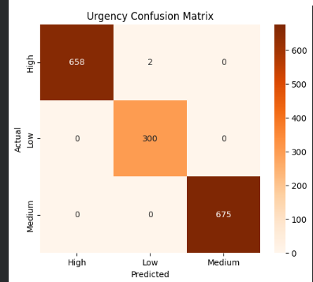
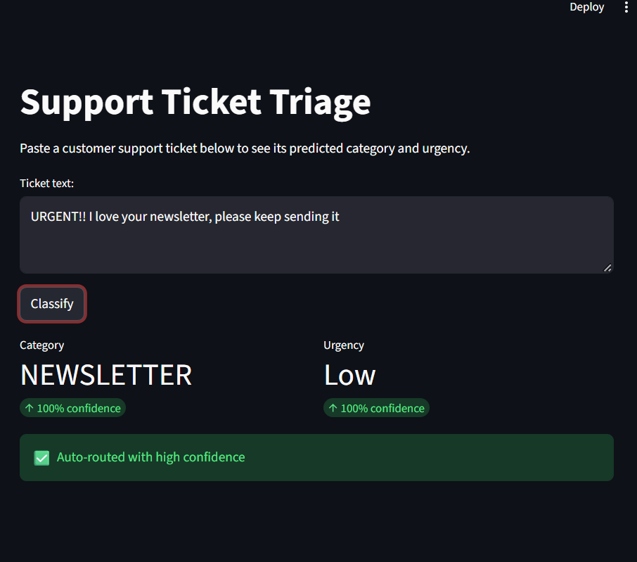
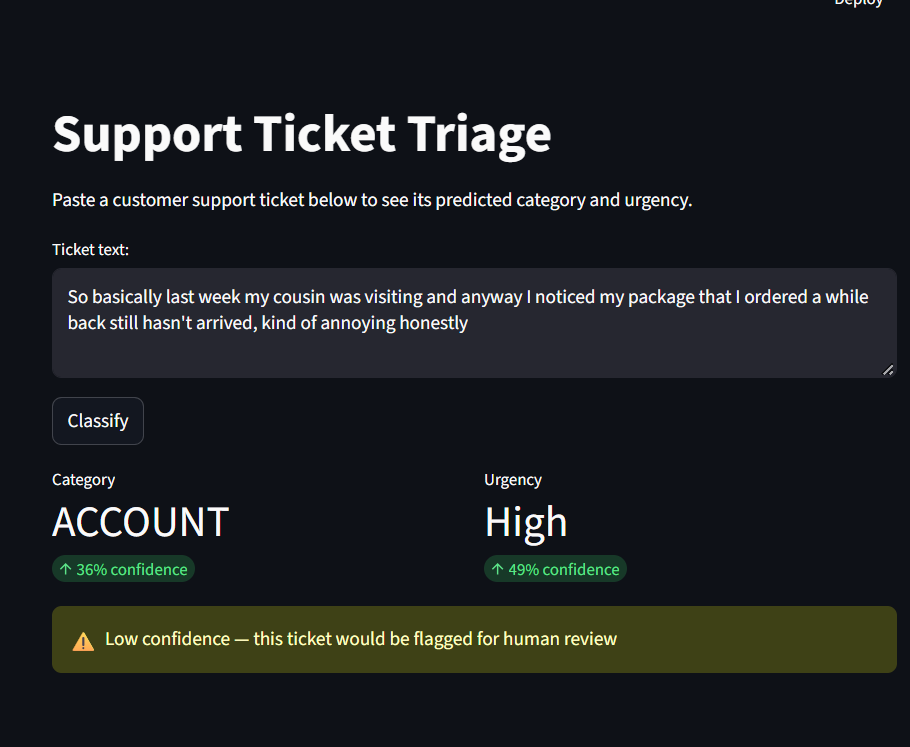
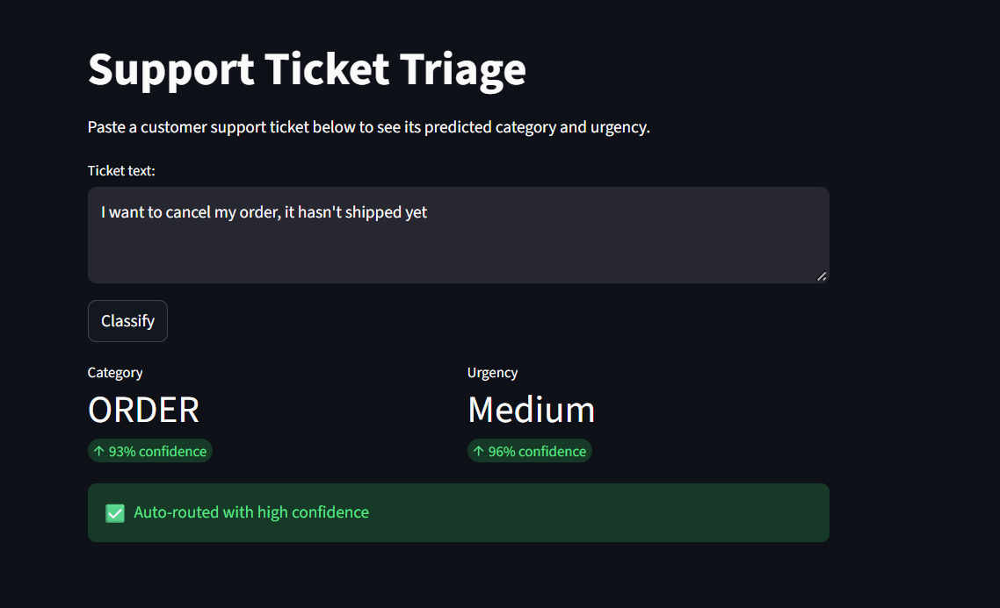

# AI Customer Support Ticket Triage

Automated ticket classification system that predicts a support ticket's **category** and **urgency**, then routes it to a queue — flagging low-confidence predictions for human review instead of guessing.

## Problem

Support teams need to read, categorize, and prioritize every incoming ticket before routing it. This project automates that first triage step end-to-end: data → cleaning → features → two trained classifiers → evaluation → a deployed dashboard with a human-review safety net.

## Dataset

- **Source:** [Bitext Customer Support Intent Dataset](https://www.kaggle.com/datasets/bitext/training-dataset-for-chatbotsvirtual-assistants) (8,175 utterances, 11 categories)
- **Note:** An earlier dataset (Kaggle's suraj520 Customer Support Ticket Dataset) was tried first but discarded — its category/priority labels turned out to be statistically unrelated to the ticket text, producing near-chance accuracy (~21–26%). Switching datasets fixed this; see Key Findings below.
- **Urgency labels:** No ground-truth urgency field exists in the data, so urgency was constructed via a transparent rule — a keyword override (e.g. "urgent", "locked out") combined with a category-based default mapping.

## Approach

1. Text cleaning (lowercase, strip punctuation/whitespace)
2. 80/20 stratified train/test split
3. TF-IDF vectorization (5,000 features, unigrams + bigrams)
4. Two separate Logistic Regression classifiers — one for category, one for urgency
5. Evaluation via per-class precision/recall/F1 and confusion matrices
6. Deployment as a Streamlit dashboard with a 0.6 confidence threshold for auto-routing vs. human review

## Results

| Model | Accuracy |
|---|---|
| Category classifier | 99.69% |
| Urgency classifier | 99.88% |

## Key Findings

- **A complete-looking dataset can still have zero usable signal.** The first dataset had every column the project needed, yet its labels didn't correlate with the text at all — a reminder that schema completeness isn't label quality.
- **The urgency model never actually learned to recognize the word "urgent."** Stress-testing with *"URGENT!! I love your newsletter, please keep sending it"* returned **Low** urgency at 100% confidence — the model had learned "category predicts urgency" far more strongly than it learned the literal keyword rule used to build its own training labels, since real messages in the dataset rarely contain that word.
- **TF-IDF has no concept of negation or spelling.** *"I do NOT want to cancel my order"* was classified the same way as a genuine cancellation request, and typos measurably dropped confidence.
- **The confidence-based human-review system works as intended** — a rambling, off-topic ticket was misclassified, but confidence dropped low enough to correctly trigger a human-review flag rather than silently returning a wrong answer.

## Deployment

Trained models are serialized with `joblib` and served through a Streamlit dashboard (`app.py`). Every prediction below the 0.6 confidence threshold is logged to `flagged_for_review.csv` with a timestamp, creating a real, persistent human-review queue rather than just an on-screen warning.

## Tech Stack

Python · scikit-learn · pandas · Streamlit · joblib

## Run locally

\`\`\`bash
pip install -r requirements.txt
streamlit run app.py
\`\`\`

## Limitations & Future Work

- Replace TF-IDF with sentence embeddings to address the negation/typo blind spots
- Source real historical urgency labels rather than a constructed rule
- Add spell-correction preprocessing